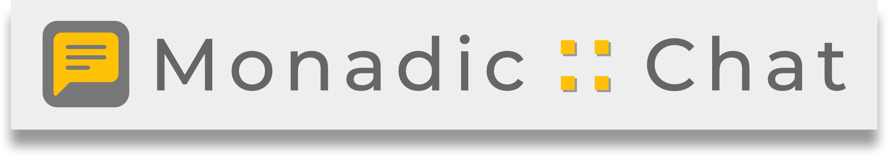

# Monadic Chat Documentation

Welcome to the Monadic Chat documentation!

Monadic Chat is a locally hosted web application for creating and utilizing intelligent chatbots. It provides AI models with a real Linux environment through Docker, enabling advanced tasks with external tools. Use this documentation to learn how to install, use, and extend Monadic Chat.

---

## Getting Started

Start here to install and set up Monadic Chat.

*   [Quick Start Tutorial](/getting-started/quick-start.md)
*   [Installation](/getting-started/installation.md)
*   [Uninstallation](/getting-started/uninstallation.md)

## Basic Usage

Learn the fundamentals of using Monadic Chat's features and built-in applications.

*   [Console Panel](/basic-usage/console-panel.md)
*   [Web Interface](/basic-usage/web-interface.md)
*   [Message Input](/basic-usage/message-input.md)
*   [Workflow Viewer](/basic-usage/workflow-viewer.md)
*   [Basic Apps](/basic-usage/basic-apps.md)
*   [PDF Database](/basic-usage/pdf_storage.md)
*   [Syntax Highlighting](/basic-usage/syntax-highlighting.md)

## Apps

Detailed documentation for each of the built-in applications.

*   [Chat & Assistant Apps](/apps/chat-apps.md)
*   [Language Learning Apps](/apps/language-apps.md)
*   [Writing & Document Apps](/apps/writing-apps.md)
*   [Image Generator](/apps/image-generator.md)
*   [Video Generator](/apps/video-generator.md)
*   [Music Generator](/apps/music-generator.md)
*   [Diagram & Visualization Apps](/apps/diagram-apps.md)
*   [Web & Media Analysis Apps](/apps/analysis-apps.md)
*   [Knowledge Base](/apps/knowledge-base.md)
*   [Coding & Notebook Apps](/apps/coding-apps.md)
*   [Music Lab & Music Analyst](/apps/music-apps.md)
*   [AutoForge / Artifact Builder](/apps/auto_forge.md)

## Docker Integration

Understand how Monadic Chat leverages Docker for its powerful AI environment.

*   [Basic Architecture](/docker-integration/basic-architecture.md)
*   [Docker Containers](/docker-integration/docker-access.md)
*   [JupyterLab](/docker-integration/jupyterlab.md)
*   [Shared Folder](/docker-integration/shared-folder.md)
*   [Standard Python Container](/docker-integration/python-container.md)
*   [Vector Database](/docker-integration/vector-database.md)

## Advanced Topics

Explore advanced configurations, app development, and integration possibilities.

*   [Advanced Configuration](/advanced-topics/advanced-configuration.md)
*   [Development of Extra Apps](/advanced-topics/develop_apps.md)
*   [File Organization for App Developers](/advanced-topics/code_structure.md)
*   [Monadic DSL Reference](/advanced-topics/monadic_dsl.md)
*   [Application Setting Items](/advanced-topics/setting-items.md)
*   [Recipe Examples](/advanced-topics/recipe-examples.md)
*   [Tool Groups](/advanced-topics/tool-groups.md)
*   [Monadic Mode](/advanced-topics/monadic-mode.md)
*   [Session Context](/advanced-topics/session-context.md)
*   [Adding Docker Containers](/advanced-topics/adding-containers.md)
*   [Using Ollama](/advanced-topics/ollama.md)
*   [Help System Configuration](/advanced-topics/help-system.md)
*   [MCP Integration](/advanced-topics/mcp-integration.md)
*   [Privacy Filter](/advanced-topics/privacy-filter.md)

## Reference

Detailed information on configuration and other technical aspects.

*   [Providers & Models](/reference/providers.md)
*   [Configuration Reference](/reference/configuration.md)

## Frequently Asked Questions

Find answers to common questions about Monadic Chat.

*   [Setup and Settings](/faq/faq-settings.md)
*   [User Interface](/faq/faq-user-interface.md)
*   [Basic Apps](/faq/faq-basic-apps.md)
*   [Sending Media Files](/faq/faq-media-files.md)
*   [Voice Interaction](/faq/faq-voice-interaction.md)
*   [Adding New Features](/faq/faq-extra-features.md)

---

📖 **[Changelog](/changelog.md)** · 📝 **[Related blog posts](https://yohasebe.com/tags/monadic-chat/)**